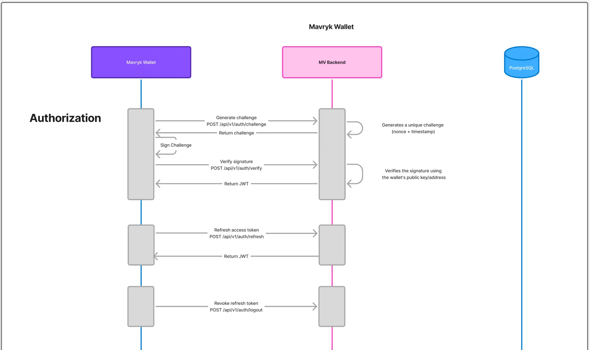
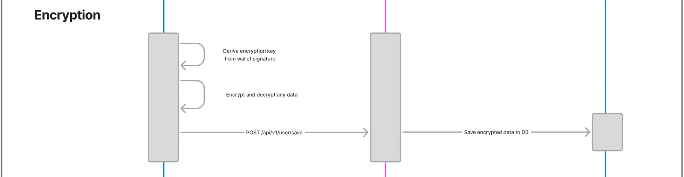
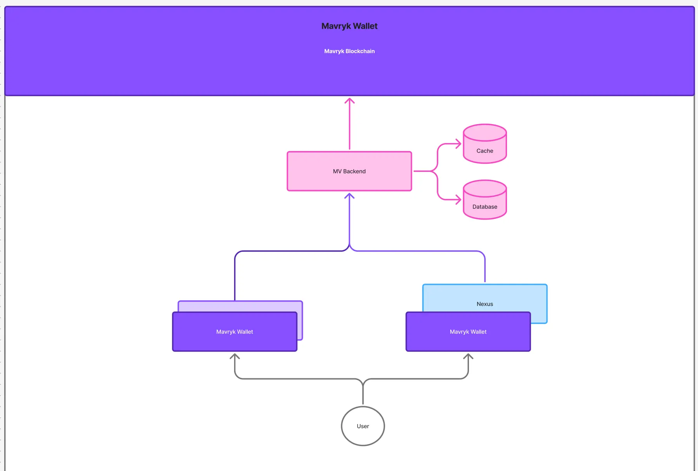
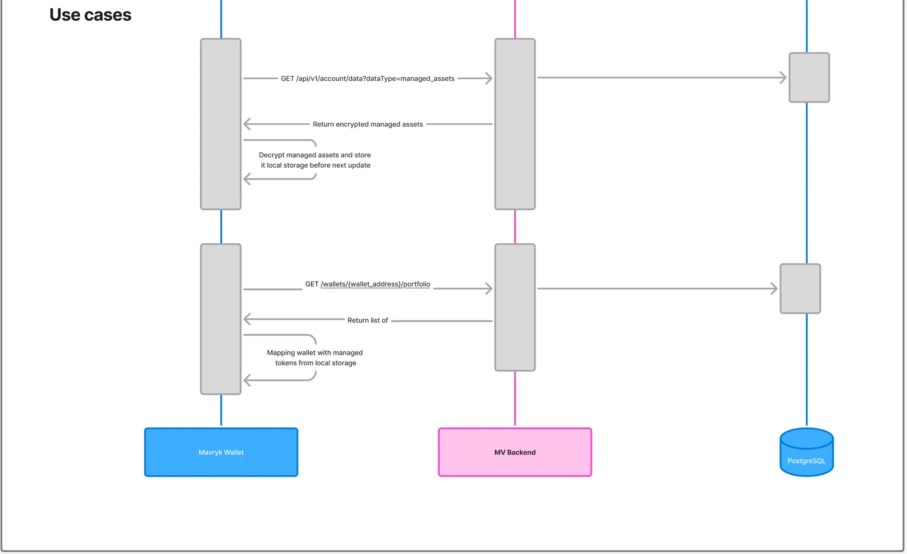
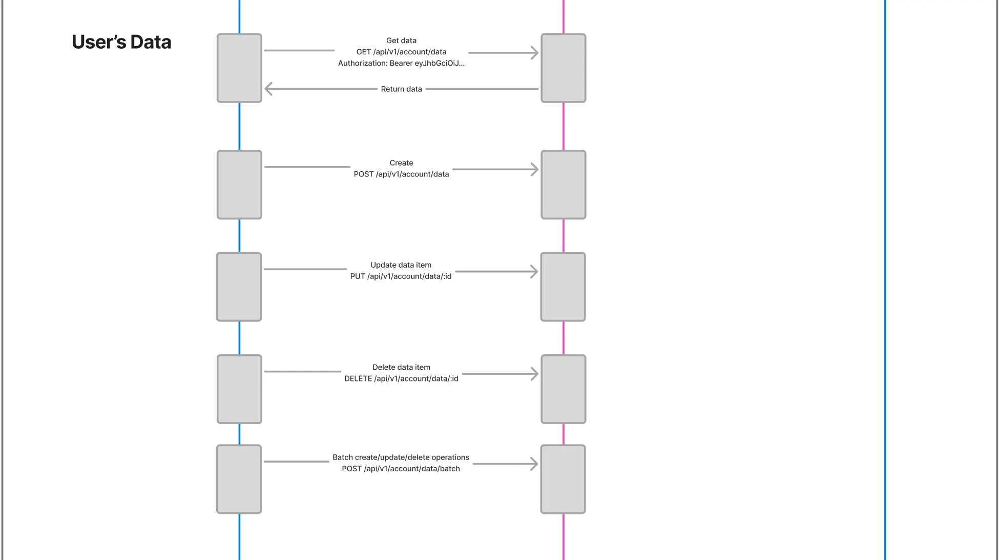

## Overview

The Mavryk Wallet Backend uses the Taquito/Mavryk standard message signing format, which conforms to the Micheline encoding standard for data serialization. Signatures are created using Ed25519 (or other supported curves: Secp256k1, P-256).

---

## Signature Creation Process (Client-Side)

### Step 1: Message Preparation

The message is converted from plain text to a format suitable for signing:

```
Plain text message
→ Convert to UTF-8 bytes
→ Convert bytes to hex string

```

**Example:**

- Message: `"Hello world"` (11 bytes)
- UTF-8 bytes: `[0x48, 0x65, 0x6c, 0x6c, 0x6f, 0x20, 0x77, 0x6f, 0x72, 0x6c, 0x64]`
- Hex string: `"48656c6c6f20776f726c64"` (22 characters)

### Step 2: Apply char2Bytes

The hex string is converted to bytes using Taquito's `char2Bytes` function:

```
Hex string → char2Bytes() → Bytes (each hex character → one byte)

```

**Important:** `char2Bytes()` in Taquito converts a hex string to bytes where each hex character becomes one byte (its ASCII code).

**Example:**

- Hex string: `"4865"`
- char2Bytes result: `[0x34, 0x38, 0x36, 0x35]` (ASCII codes of characters '4', '8', '6', '5')
- Length: 22 bytes (for "Hello world")

### Step 3: Format Payload in Micheline Format

The payload is structured according to the Micheline encoding standard:

```
Format: 05 01 [4 bytes length] [message bytes]

```

**Structure:**

- `05` - Micheline expression prefix (1 byte)
- `01` - String type tag (1 byte)
- `[4 bytes]` - Message length in big-endian format
- `[bytes]` - Message bytes (result of char2Bytes)

**Example for "Hello world":**

```
05 01 00 00 00 16 [22 bytes of hex string]
│  │  └─┬─┘      └─ messageHexBytes
│  │    └─ length = 22 (0x00000016)
│  └─ string tag
└─ Micheline prefix

```

### Step 4: Hash Payload

The payload is hashed using Blake2b:

```
Payload bytes → Blake2b (32 bytes) → Digest

```

**Algorithm:** Blake2b with output size of 32 bytes (256 bits)

**Example:**

- Payload: `[0x05, 0x01, 0x00, 0x00, 0x00, 0x16, 0x34, 0x38, ...]`
- Digest: `[32 bytes of Blake2b hash]`

### Step 5: Sign Digest

The digest is signed using the private key:

```
Digest → Ed25519.Sign(privateKey, digest) → Signature

```

**Result:** Signature in format `edsig...` (Ed25519), `spsig...` (Secp256k1), or `p2sig...` (P-256)

---

## Signature Verification Process (Server-Side)

### Step 1: Parse Input Data

The signature string is parsed to extract the public key and signature:

```
signatureStr = "edpkXXX:edsigYYY"
→ Split by ':'
→ Public key: "edpkXXX"
→ Signature: "edsigYYY"

```

### Step 2: Validate Address and Public Key

The wallet address and public key are validated:

```
1. Parse wallet address (mv1...)
2. Parse public key (edpk...)
3. Verify: pubKey.Address() == walletAddress

```

### Step 3: Reconstruct Payload (Same as Creation)

The payload is reconstructed using the same process as signature creation:

```
1. message → UTF-8 bytes
2. Bytes → hex string
3. Hex string → bytes (each character → one byte)
4. Format payload: 05 01 [4 bytes length] [bytes]

```

**Important:** The process must be identical to the signature creation process!

### Step 4: Hash Payload

The payload is hashed using the same algorithm:

```
Payload → Blake2b (32 bytes) → Digest

```

**Algorithm:** Same Blake2b as used during creation

### Step 5: Verify Signature

The signature is verified against the digest:

```
pubKey.Verify(digest, signature) → true/false

```

**Verification:** Ed25519 (or other curve) signature verification

---

## Data Format

### Input Data for Verification

```
walletAddress: "mv1Ccrw1BeR24LNTeLTrj5GjTtEh7Wq86SHv"
message: "Hello world" (or full challenge text)
signatureStr: "edpku1LDq6DH9kspUEGTh6M7id7jUgSd2qzY3vWZnuE7WtUQMa6KT2:edsigu54RgjRT8mdaPWKCuxLGDzmNqQvNxgYxLwHtdXQSvRELKHmzdLcdqQNrfGa4V1SHCjw3eb3Vec7wcEQMrMDRaigc2jxPsd"

```

### Intermediate Data (for "Hello world")

```
messageBytes: [0x48, 0x65, 0x6c, 0x6c, 0x6f, 0x20, 0x77, 0x6f, 0x72, 0x6c, 0x64] (11 bytes)
messageHex: "48656c6c6f20776f726c64" (22 characters)
messageHexBytes: [0x34, 0x38, 0x36, 0x35, ...] (22 bytes - ASCII codes of hex characters)
length: 22 (0x00000016 in big-endian)
payload: [0x05, 0x01, 0x00, 0x00, 0x00, 0x16, 0x34, 0x38, ...] (28 bytes)
digest: [32 bytes of Blake2b hash]

```

---

## Key Points

1. **char2Bytes**: Converts hex string to bytes where each hex character becomes one byte (ASCII code)
2. **Micheline Format**: `05 01 [4 bytes length] [data]` - standard format for strings in Mavryk
3. **Blake2b**: Used for payload hashing (not SHA256!)
4. **Ed25519**: Cryptographic signature scheme (Secp256k1 and P-256 are also supported)
5. **Big-endian**: Length is encoded in big-endian format (most significant byte first)

---

## Important Notes

1. **Exact Match**: The creation and verification processes must be identical
2. **Encoding**: Always use UTF-8 for messages
3. **Length**: The length in payload is the length of `messageHexBytes`, not the original message
4. **Signature Format**: Format `publicKey:signature` is required for full cryptographic verification

---

## References

- **Taquito Documentation**: https://taquito.mavryk.org/docs/next/signing/
- **Mavryk Network**: https://mavryk.org/
- **Blake2b**: https://www.blake2.net/
- **Ed25519**: https://ed25519.cr.yp.to/
