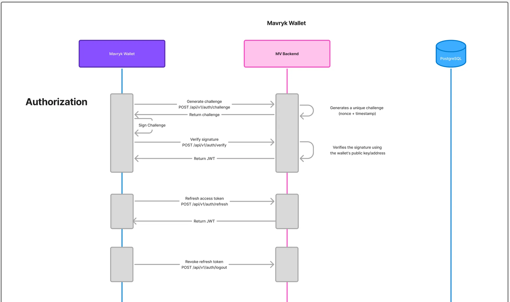
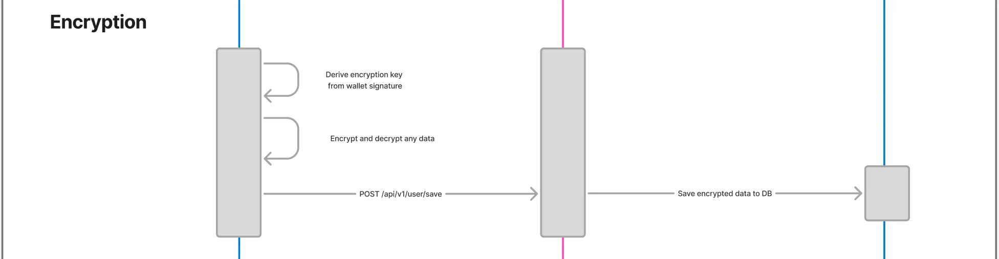
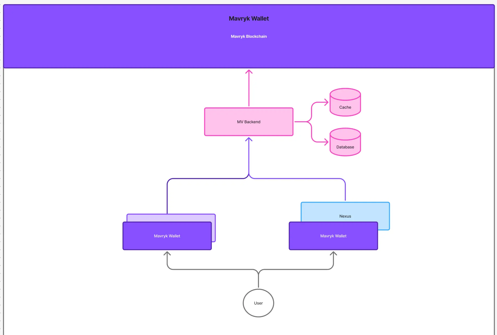
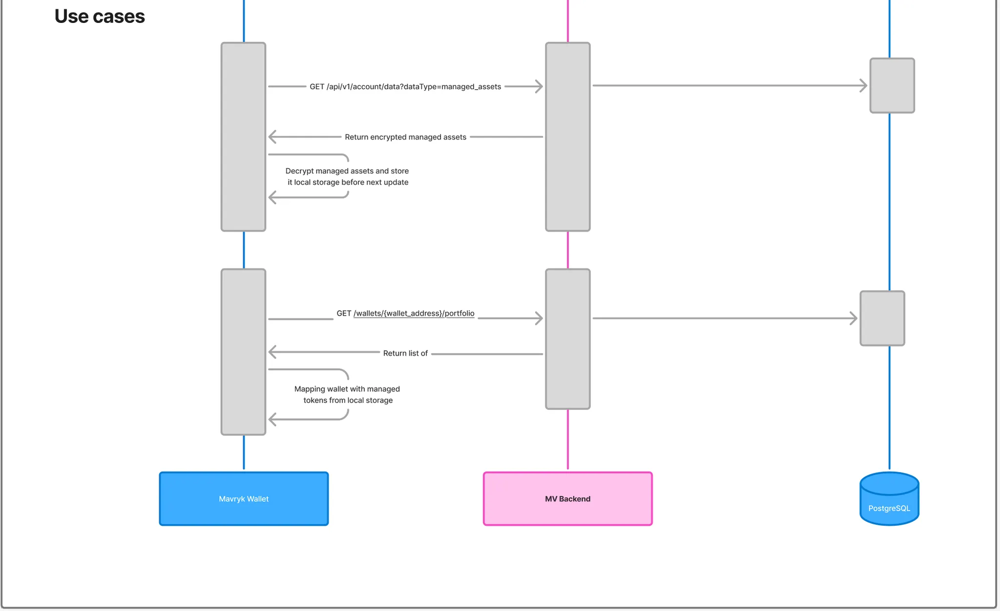
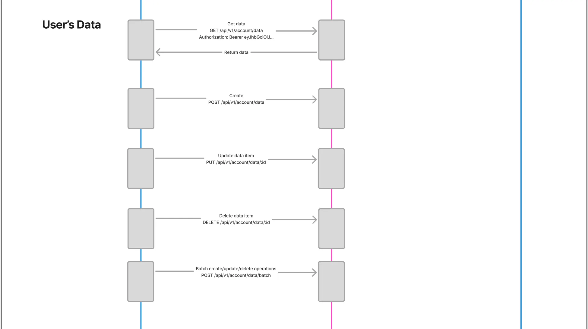

## Overview

The Mavryk Wallet Backend uses the Taquito/Mavryk standard message signing format, which conforms to the Micheline encoding standard for data serialization. Signatures are created using Ed25519 (or other supported curves: Secp256k1, P-256).

## Authentication Endpoints

- `POST /auth/challenge` returns the structured challenge text, nonce, and expiration used for wallet signing.
- `POST /auth/verify` verifies the signed challenge and returns an `accessToken` plus `refreshToken`.
- `POST /auth/refresh` rotates the refresh token and returns a new `accessToken` plus `refreshToken`.
- `POST /auth/logout` invalidates the provided refresh token.

Tokens are returned only in JSON response bodies. The client is responsible for storing both tokens and sending the access token in protected requests. The client does not attach `Authorization` to `/auth/challenge`, `/auth/verify`, `/auth/refresh`, or `/auth/logout`.

## Auth Challenge Contract

The preferred backend challenge should exactly match the client-constructed structured message:

```text
Mavryk Wallet Authentication

Please sign this message to authenticate.

Wallet Address: <mv1...>
Network: <mainnet|basenet|...>
Nonce: <16-256 char nonce>
Expires At: <ISO timestamp>
Audience: mavryk-wallet-api
```

Client validation before signing:

- `challenge` length must be at most 1024 characters.
- `nonce` must match `^[A-Za-z0-9._~-]{16,256}$`.
- `expiresAt` must parse as an ISO timestamp, be in the future, and be no more than 10 minutes ahead of client time.
- `Wallet Address`, `Network`, `Nonce`, `Expires At`, and `Audience` must exactly match the request context and response fields.

Malformed or legacy free-form challenges are rejected before storage and are never signed silently.

Until the backend is migrated to include `Network` and `Audience`, the client also accepts the current backend structured
message:

```text
Mavryk Wallet Authentication

Please sign this message to authenticate.

Wallet Address: <mv1...>
Nonce: <16-256 char nonce>
Timestamp: <ISO timestamp>
Expires: <ISO timestamp>

This request will not trigger a blockchain transaction or cost any gas fees.
```

Compatibility validation still rejects arbitrary text. The wallet address and nonce must match the challenge response,
the response `expiresAt` must pass the normal expiry checks, and the challenge `Expires` timestamp must match the
response expiry within one second.

For `/auth/verify`, accepted auth challenge messages are signed with the verifier-compatible auth challenge payload
encoding described below. This preserves the deployed backend contract while still preventing arbitrary challenge text
from being signed.

## Refresh Token Rotation

Refresh tokens use rotation. Every successful `POST /auth/refresh` response returns a new token pair:

```json
{
  "accessToken": "...",
  "refreshToken": "..."
}
```

The previous refresh token is invalid immediately after rotation. The client must replace the stored access token and refresh token together after every successful refresh.

The refresh token lifetime uses a sliding window. Each successful rotation extends refresh expiration to `now + 720h`.

## Refresh Reuse Detection

If a previously rotated refresh token is used again, the API returns `401 REFRESH_TOKEN_REUSE` and revokes the refresh token family for the account.

The client must treat `REFRESH_TOKEN_REUSE` as a terminal authentication failure:

- clear stored auth tokens for that wallet;
- do not attempt another refresh with the same token family;
- require the user to authenticate again.

Protected endpoints may also return `401 Token has been revoked`. This is also terminal and should clear stored auth tokens instead of attempting refresh.

Because refresh tokens rotate, clients must serialize refresh calls for each wallet/network auth scope. Multiple simultaneous refresh calls with the same refresh token can trigger reuse detection. Browser contexts that can run at the same time should coordinate refresh and read the latest stored token pair before refreshing.

## Client Token Storage And Lock Behavior

The client validates token responses before storage:

- `accessToken` must be JWT-like (`header.payload.signature`) with a parseable, unexpired `exp` claim.
- `refreshToken` must be a non-empty string no longer than 4096 characters.

On wallet lock/logout, the client captures stored refresh tokens for best-effort server revocation, clears all scoped and legacy auth token keys locally first, then calls `/auth/logout`. A network or backend logout failure must not keep local access or refresh tokens.

---

## Signature Creation Process (Client-Side)

### Step 1: Message Preparation

The message is converted from plain text to a format suitable for signing:

```
Plain text message
→ Convert to UTF-8 bytes
→ Convert bytes to hex string

```

**Example:**

- Message: `"Hello world"` (11 bytes)
- UTF-8 bytes: `[0x48, 0x65, 0x6c, 0x6c, 0x6f, 0x20, 0x77, 0x6f, 0x72, 0x6c, 0x64]`
- Hex string: `"48656c6c6f20776f726c64"` (22 characters)

### Step 2: Apply char2Bytes

The hex string is converted to bytes using Taquito's `char2Bytes` function:

```
Hex string → char2Bytes() → Bytes (each hex character → one byte)

```

**Important:** `char2Bytes()` in Taquito converts a hex string to bytes where each hex character becomes one byte (its ASCII code).

**Example:**

- Hex string: `"4865"`
- char2Bytes result: `[0x34, 0x38, 0x36, 0x35]` (ASCII codes of characters '4', '8', '6', '5')
- Length: 22 bytes (for "Hello world")

### Step 3: Format Payload in Micheline Format

The payload is structured according to the Micheline encoding standard:

```
Format: 05 01 [4 bytes length] [message bytes]

```

**Structure:**

- `05` - Micheline expression prefix (1 byte)
- `01` - String type tag (1 byte)
- `[4 bytes]` - Message length in big-endian format
- `[bytes]` - Message bytes (result of char2Bytes)

**Example for "Hello world":**

```
05 01 00 00 00 16 [22 bytes of hex string]
│  │  └─┬─┘      └─ messageHexBytes
│  │    └─ length = 22 (0x00000016)
│  └─ string tag
└─ Micheline prefix

```

### Step 4: Hash Payload

The payload is hashed using Blake2b:

```
Payload bytes → Blake2b (32 bytes) → Digest

```

**Algorithm:** Blake2b with output size of 32 bytes (256 bits)

**Example:**

- Payload: `[0x05, 0x01, 0x00, 0x00, 0x00, 0x16, 0x34, 0x38, ...]`
- Digest: `[32 bytes of Blake2b hash]`

### Step 5: Sign Digest

The digest is signed using the private key:

```
Digest → Ed25519.Sign(privateKey, digest) → Signature

```

**Result:** Signature in format `edsig...` (Ed25519), `spsig...` (Secp256k1), or `p2sig...` (P-256)

---

## Signature Verification Process (Server-Side)

### Step 1: Parse Input Data

The signature string is parsed to extract the public key and signature:

```
signatureStr = "edpkXXX:edsigYYY"
→ Split by ':'
→ Public key: "edpkXXX"
→ Signature: "edsigYYY"

```

### Step 2: Validate Address and Public Key

The wallet address and public key are validated:

```
1. Parse wallet address (mv1...)
2. Parse public key (edpk...)
3. Verify: pubKey.Address() == walletAddress

```

### Step 3: Reconstruct Payload (Same as Creation)

The payload is reconstructed using the same process as signature creation:

```
1. message → UTF-8 bytes
2. Bytes → hex string
3. Hex string → bytes (each character → one byte)
4. Format payload: 05 01 [4 bytes length] [bytes]

```

**Important:** The process must be identical to the signature creation process!

### Step 4: Hash Payload

The payload is hashed using the same algorithm:

```
Payload → Blake2b (32 bytes) → Digest

```

**Algorithm:** Same Blake2b as used during creation

### Step 5: Verify Signature

The signature is verified against the digest:

```
pubKey.Verify(digest, signature) → true/false

```

**Verification:** Ed25519 (or other curve) signature verification

---

## Data Format

### Input Data for Verification

```
walletAddress: "mv1Ccrw1BeR24LNTeLTrj5GjTtEh7Wq86SHv"
message: "Hello world" (or full challenge text)
signatureStr: "edpku1LDq6DH9kspUEGTh6M7id7jUgSd2qzY3vWZnuE7WtUQMa6KT2:edsigu54RgjRT8mdaPWKCuxLGDzmNqQvNxgYxLwHtdXQSvRELKHmzdLcdqQNrfGa4V1SHCjw3eb3Vec7wcEQMrMDRaigc2jxPsd"

```

### Intermediate Data (for "Hello world")

```
messageBytes: [0x48, 0x65, 0x6c, 0x6c, 0x6f, 0x20, 0x77, 0x6f, 0x72, 0x6c, 0x64] (11 bytes)
messageHex: "48656c6c6f20776f726c64" (22 characters)
messageHexBytes: [0x34, 0x38, 0x36, 0x35, ...] (22 bytes - ASCII codes of hex characters)
length: 22 (0x00000016 in big-endian)
payload: [0x05, 0x01, 0x00, 0x00, 0x00, 0x16, 0x34, 0x38, ...] (28 bytes)
digest: [32 bytes of Blake2b hash]

```

---

## Key Points

1. **char2Bytes**: Converts hex string to bytes where each hex character becomes one byte (ASCII code)
2. **Micheline Format**: `05 01 [4 bytes length] [data]` - standard format for strings in Mavryk
3. **Blake2b**: Used for payload hashing (not SHA256!)
4. **Ed25519**: Cryptographic signature scheme (Secp256k1 and P-256 are also supported)
5. **Big-endian**: Length is encoded in big-endian format (most significant byte first)

---

## Important Notes

1. **Exact Match**: The creation and verification processes must be identical
2. **Encoding**: Always use UTF-8 for messages
3. **Length**: The length in payload is the length of `messageHexBytes`, not the original message
4. **Signature Format**: Format `publicKey:signature` is required for full cryptographic verification

---

## References

- **Taquito Documentation**: https://taquito.mavryk.org/docs/next/signing/
- **Mavryk Network**: https://mavryk.org/
- **Blake2b**: https://www.blake2.net/
- **Ed25519**: https://ed25519.cr.yp.to/
